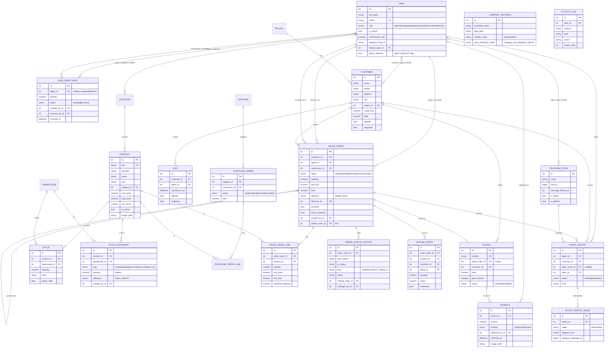
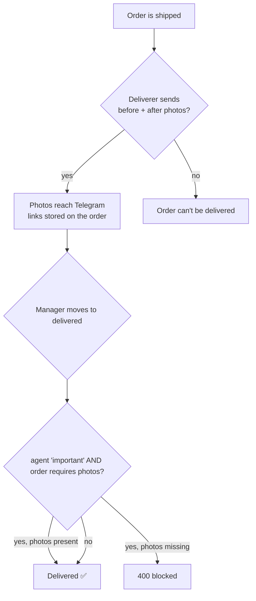
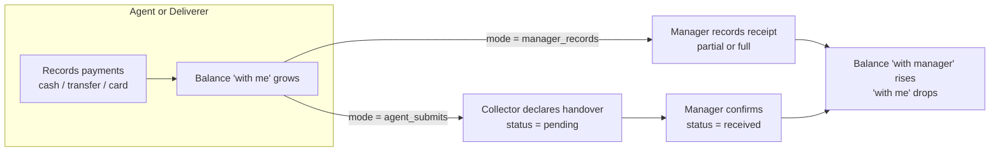
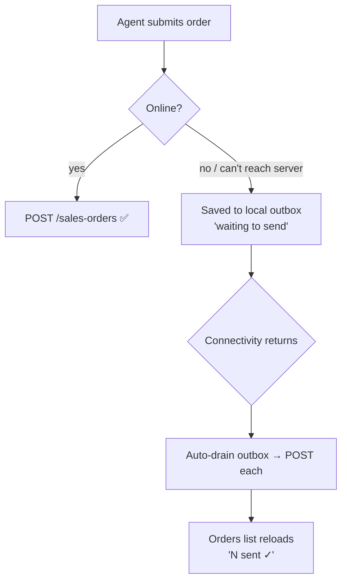
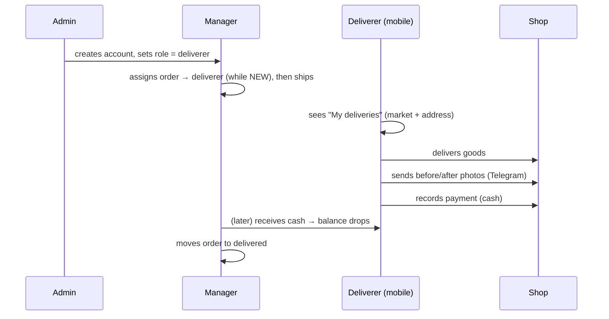

# Warehouse Distribution ERP — Full Documentation

End‑to‑end reference for the system: what it does, how it's built, the data model
(ERD), the business workflows, and the complete feature set.

> Related docs: **[README.md](README.md)** (quick start) ·
> **[RULES.md](RULES.md)** (rules, RU) · **[DEPLOYMENT.md](DEPLOYMENT.md)** /
> **[DEPLOYMENT.ru.md](DEPLOYMENT.ru.md)** (deploy).

---

## 1. What this is

An ERP for a **single‑warehouse FMCG distribution business**:

- **Field agents** visit shops (markets) and take orders on a mobile app.
- **Managers** review orders and move them through the workflow; assign a
  **deliverer**.
- **Deliverers** deliver the goods, collect the money, send before/after photos,
  and hand the cash to the manager.
- The **web admin** runs inventory, orders, invoices/debt, cash custody, reports,
  branding, Telegram config, and user accounts.
- **Telegram** receives before/after photo albums for shop visits.

---

## 2. Architecture

```
                         ┌─────────────────────────────┐
   Web admin (browser) ─▶│  web  (nginx)  :80           │
                         │   React SPA + proxy /api,/uploads │
                         └──────────────┬──────────────┘
   Agent app  ───────────┐              │  (internal network)
   Deliverer app ────────┤ HTTPS /api/v1▼
                         ┌─────────────────────────────┐
                         │  backend (FastAPI)  :8000    │
                         │   REST API · nightly archive │
                         │   Telegram send · /uploads   │
                         └──────────────┬──────────────┘
                                        ▼
                         ┌─────────────────────────────┐
                         │  db (PostgreSQL 16)          │
                         └─────────────────────────────┘
```

| Component | Tech | Audience |
|---|---|---|
| `backend/` | Python, FastAPI, SQLAlchemy 2.0 async, Pydantic v2, Postgres | API for all clients |
| `web/` | React + Vite + TypeScript + Tailwind CSS v4, React Query, React Router | Managers / admin / accountant |
| `mobile/` | Flutter (Clean Architecture + BLoC/Cubit) | Field agents **and** deliverers |
| Telegram | Backend service (outbound only) | Before/after photo albums, alerts |

**Cross‑cutting**
- **Auth:** JWT (bearer). Passwords hashed with bcrypt.
- **Timezone:** Asia/Tashkent (nightly jobs, receipts, photo captions).
- **i18n:** Russian (default), Uzbek, English — web (`messages.ts`) and mobile
  (JSON assets in `assets/l10n/`).
- **Uploads:** product images, payment receipts, branding logo served at
  `/uploads/…`. Photo *reports* live in Telegram only (deep‑linked).

---

## 3. Roles & permissions

| Role | Where | Can do |
|---|---|---|
| **admin** | web | Everything: user accounts & roles, branding, Telegram topics, activity log, assign photo topics/importance, cash handover mode. |
| **manager** | web | Orders (move status, assign deliverer), pricing/discounts, refunds, reports, receive cash from agents/deliverers, agent shop/category assignment, all reads. |
| **accountant** | web | Invoices, payments, debt, receive cash. |
| **warehouse** | web | Stock receipts, adjustments, purchasing. |
| **agent** | **mobile** | Create orders, browse catalog, manage own shops, track own orders. |
| **deliverer** | **mobile** | See assigned deliveries (market + address), collect payments, send before/after photos, print receipts, hand cash to manager. |

- **admin marks an account as a deliverer** (role assignment, admin‑only Accounts
  page). **manager controls the work** (assigns which order goes to which
  deliverer).
- Mobile app auto‑routes by role: `deliverer` → deliverer app, otherwise → agent
  app.

---

## 4. Data model (ERD)



> `COMPANY_SETTINGS` (singleton) and `ACTIVITY_LOG` are standalone config/audit
> tables. **Association tables:** `customer_agents`, `agent_categories`,
> `agent_topics` (all M2M on `users`).

### Enumerations

| Enum | Values |
|---|---|
| `UserRole` | admin, manager, agent, warehouse, accountant, **deliverer** |
| `SalesOrderStatus` | new, shipped, delivered, refund, cancelled *(legacy: draft/pending/approved/rejected/picking kept for old rows)* |
| `PurchaseOrderStatus` | draft, ordered, received, cancelled |
| `StockMovementType` | receipt, sale, adjustment, return_in, return_out |
| `InvoiceStatus` | unpaid, partial, paid |
| `PaymentMethod` | cash, transfer, card |
| `PhotoStage` | before, after |
| `PhotoReportStatus` | pending, sent, failed |
| `CashRemittanceStatus` | pending, received |

---

## 5. Core workflows

### 5.1 Sales‑order lifecycle (manager‑driven)

```mermaid
stateDiagram-v2
    [*] --> new : agent creates (mobile)
    new --> shipped : manager ships\n(deduct stock + create invoice + raise debt)
    shipped --> delivered : manager confirms\n(gated by before/after photos)
    new --> cancelled : manager cancels
    shipped --> cancelled : manager cancels (cut debt)
    shipped --> refund : manager refunds\n(cut debt; restock or hold)
    delivered --> refund : partial/whole return
    delivered --> [*]
    refund --> [*]
    cancelled --> [*]

    note right of shipped
      Nightly 00:00 Asia/Tashkent:
      delivered / cancelled / refund → archived
      (shipped is never archived)
    end note
```



- **Only managers/admins change status.** Agents create; deliverers deliver but do
  **not** change status.
- **Partial move → fork:** moving *some* lines forks a new order for the moved
  goods; the remainder keeps its status. Numbering: `#15` normal, `#15.1`, `#15.2`
  for forks; the original keeps `#15`. Every transition is written to
  `order_status_history` (kind = create/move/fork_out/fork_in), viewable as a full
  order tree.
- **Refund** cuts the customer's debt and either **restocks** the goods or holds
  them in a "refunded goods" register (manager chooses).

### 5.2 Before/after photo gate (on delivery)



- Photos are **Telegram‑only** (never stored on the server) and sent as **one
  album** with a caption: shop, order id, agent, 24h date, comment, and hashtags
  `#shop_… #user_… #order_… #month_…`.
- A report is **pinned to an order only while it is shipped**; managers/admins pick
  which **topics** an agent may send to; a report with no active topic is saved
  `FAILED`.

### 5.3 Cash custody & handover to manager



- **Balance = Σ payments the person collected − Σ remittances received.** Money is
  **"with agent/deliverer (Name)"** until handed over, then **"with manager."**
- **Admin toggles the handover mode** (`manager_records` vs `agent_submits`).
- The received amount **cannot exceed the outstanding balance**. Collectors can't
  edit amounts (derived from payments).

### 5.4 Offline order capture (agent mobile)



- Only **connectivity** failures queue; real server errors surface immediately.
- Offline banner + per‑order "waiting to send" pill; auto‑sync on reconnect.

### 5.5 Deliverer flow



---

## 6. Feature catalogue (what's built)

### Backend (FastAPI)
- Auth (JWT, register, change/forgot password), users & roles, agent↔shop /
  agent↔category / agent↔topic assignments.
- Catalog (products with front/back images, categories), inventory (stock,
  movements, low‑stock, **bulk stock‑in from Excel** template+import), purchasing
  (PO → receive → stock + cost sync), suppliers.
- Sales orders: create, manager status moves with **forking**, partial **refunds**
  (restock or hold), **status‑history tree**, nightly **archive** job, receipts.
- **Deliverer**: `deliverer_id` on orders; role‑scoped order/invoice access; orders
  carry **market name + address** for delivery.
- Finance: invoices, payments (cash/transfer/card, receipt photo), customer debt &
  credit limit.
- **Cash custody**: per‑collector balance, submit/receive/confirm/reject
  remittances, admin handover‑mode switch.
- **Photo reports**: Telegram‑only album, before/after gate, per‑agent topic
  visibility, deep links.
- Reports: dashboard, sales‑by‑agent, debt aging, commissions, agent targets.
- Branding (company name/logo/display mode), Telegram topic config, **activity log**
  (audit of all writes), photo‑report gallery.

### Web admin (React + Tailwind)
Dashboard, Orders (+move/fork/refund/receipt/history, assign deliverer), Create
order, Refunded goods, Status history, Create (products/categories), Products &
stock (+Excel import), Customers (+detail), Agents (assign shops/categories/photo
topics), Invoices & debt (+detail, record payment), **Cash from agents/deliverers**
(receive/confirm/reject, admin mode toggle), Photo reports (View in Telegram),
Reports, Accounts (roles incl. deliverer, photo‑important), Activity log, Branding,
Telegram topics. Fully localized (ru/uz/en), Tailwind utility‑class styling.

### Mobile — **Agent app**
Tabs: **Customers** (assigned shops + create shop, debt), **Create order** (offline
outbox), **Orders** (read‑only tracking), **Catalog** (full‑photo cards, price, pcs
toggle). Drawer: Settings, Sign out. Pull‑to‑refresh everywhere.

### Mobile — **Deliverer app**
Tabs: **My deliveries** (assigned orders with **market + address**, before/after
photo + receipt on shipped), **Money** (invoices → record payment), **Cash** (hand
over to manager). Settings + Sign out.

### Mobile — shared
Role‑based routing; **configurable server URL** (login + settings, persisted);
JSON‑asset i18n (ru/uz/en); Material‑3 theme; iOS‑ready (platform host + ATS +
camera/photo permissions); connectivity‑aware.

---

## 7. API surface (by router)

| Prefix | Highlights |
|---|---|
| `/auth` | login, me, register, change/forgot password |
| `/users` | list/create/update, `{id}/categories`, `{id}/topics` (admin) |
| `/categories`, `/products`, `/inventory` | catalog, stock, `stock-template`/`stock-import` |
| `/customers`, `/regions` | shops (role‑scoped), regions, `agent-shops/{id}` |
| `/sales-orders` | list (role‑scoped), get, create, `PATCH` (deliverer_id/note/photo_required), `move`, `refunds`, `status-history` |
| `/invoices`, `/payments` | invoices (role‑scoped), record payment, receipt image |
| `/cash` | `summary`, `agents`, `submit`, `receive`, `remittances/{id}/confirm|reject`, `remittances` |
| `/photo-reports` | list, create (album→Telegram), `topics` (agent‑scoped) |
| `/telegram-topics` | topic CRUD + `updates` discovery (admin) |
| `/reports` | dashboard, sales‑by‑agent, debt‑aging, commissions |
| `/meta` | company branding + `cash_handover_mode`, logo |
| `/activity` | write‑action audit log (admin) |

Interactive API docs: `http://<backend>/docs` (OpenAPI).

---

## 8. Repo layout

```
warehouse-erp/
├─ backend/   FastAPI app (app/models, app/schemas, app/api/routers, app/services)
├─ web/       React + Vite + Tailwind SPA (src/pages, src/components, src/api, src/ui)
├─ mobile/    Flutter app (lib/features/<feature>/{domain,data,presentation}, lib/core)
├─ docker-compose.yml
├─ README.md · RULES.md · DEPLOYMENT.md · DEPLOYMENT.ru.md · DOCUMENTATION.md
```

- **Backend** layers: `models` (SQLAlchemy) → `schemas` (Pydantic) → `services`
  (business logic) → `api/routers` (endpoints). Startup `app.bootstrap` runs
  `create_all` + seeds an empty DB.
- **Mobile** Clean Architecture per feature: `domain` (entities/repositories),
  `data` (datasources/impl), `presentation` (cubit/bloc + pages). DI via `get_it`.

---

## 9. Configuration

- **Backend** (`.env`): `DATABASE_URL`, `SECRET_KEY`, `BACKEND_CORS_ORIGINS`,
  `TELEGRAM_BOT_TOKEN`, `TELEGRAM_MANAGER_CHAT_ID`, `COMPANY_*`, `UPLOAD_DIR`.
- **Mobile** server URL: in‑app field (login/settings), else `--dart-define`,
  else emulator default (Android `10.0.2.2`, iOS `localhost`).
- **Handover mode / branding / photo requirement**: admin‑controlled at runtime.

See **[DEPLOYMENT.md](DEPLOYMENT.md)** for the full deploy guide (Docker Compose,
volumes, HTTPS, backups, mobile builds).

---

## 10. Status

All modules above are implemented and running against PostgreSQL. Verification is
by backend imports/tests, `tsc`/Vite build for web, and `flutter analyze` + widget
tests for mobile; key flows were checked end‑to‑end via the API and (for web) in the
browser. Business rules are summarized in **[RULES.md](RULES.md)**.
